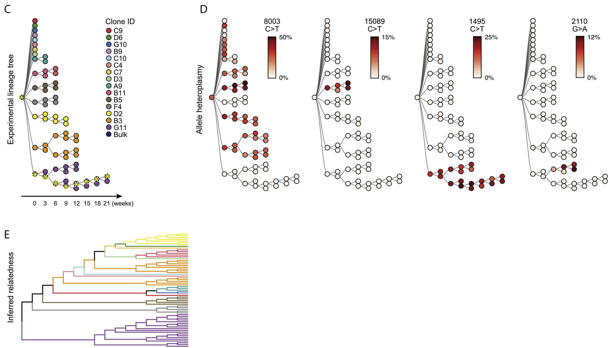
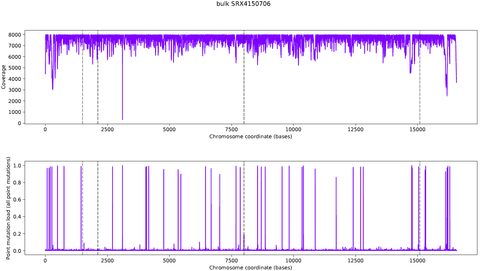
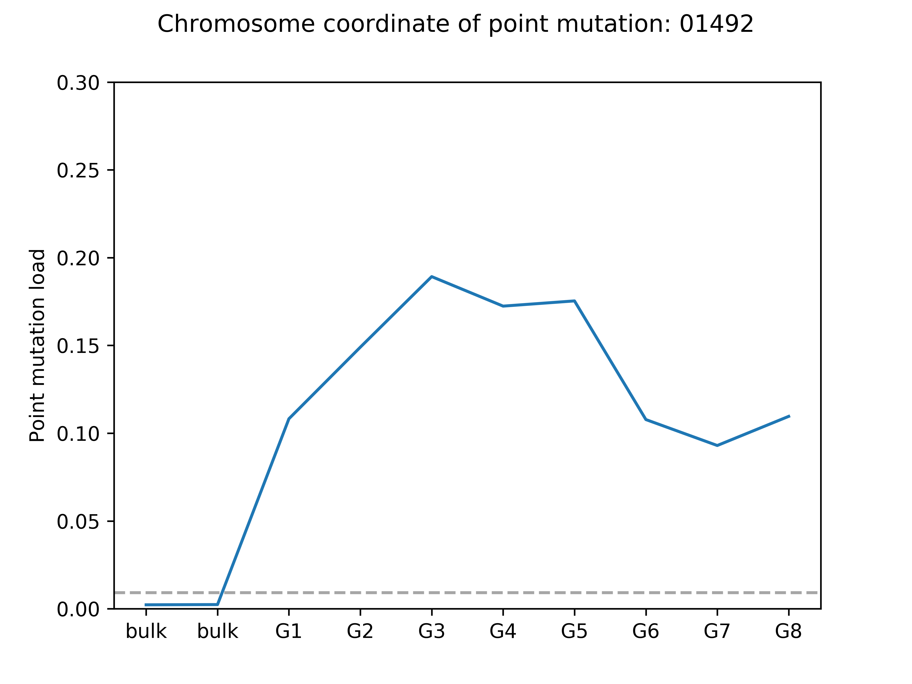

# Ludwig_2019
Re-analysis of data from [Ludwig et al. (2019)](https://doi.org/10.1016/j.cell.2019.01.022), to quantify the expansion of mtDNA mutations throughout the cell culture lineage.  Basically, assume that inital/parent population has exactly the human mtDNA reference genome (this doesn't quite seem to be the case) then look for point mutations by aligning reads from each generation with human mtDNA reference genome, counting the proportion of point mutations (deviations from reference genome) at each nucleobase.  By examining how mutation loads change along each cell lineage, we can observe (non-pathogenic) mutation populations expanding and contracting during the strict and relaxed mtDNA replication occurring in cell culture.

# Workflow
Stages of the pipeline are split into _ bash scripts. This is to allow different stages to be evaluated and ajusted if necessary before proceeding. For example: the quality of the data should be checked before alignment.

Run bash scripts for the following stages using `sbatch SCRIPT_NAME.sh`

1. Prefetch .sra files from the sequence read archive, and convert to fastq format.
2. 
3. 

**Prefetch_files.sh** is a BASH shell script. Calls **parse.py** to get metadata (creates SRR_Acc_List.txt with all the SRR names: one name per sample, for all the samples Ludwig et al., 2019). Uses SRR names in SRR_Acc_List.txt to download SRR files from the sequence read archive. Checks to make sure each SRR has been downloaded and is complete. If not, attempts to redownload. Saves .sra files to sra/sra/SRR*.sra

**parse.py** is a custom python script called by analyse.sh which gets the connection between GSM IDs (e.g. from metadata [here](https://www.ncbi.nlm.nih.gov/geo/query/acc.cgi?acc=GSE115218) and SRX IDs, which are needed to download the actual raw data.

**QC.sh**

**analyse.sh** is a BASH shell script that downloads the reference human genome and sequencing reads from the article, hosted by NCBI.  Splits reference sequence into nuclear and mitochondrial reference sequences, builds indices and aligns reads using [bowtie2](http://bowtie-bio.sourceforge.net/bowtie2/index.shtml).  First aligns reads to nuclear reference, saving reads which do not aligned.  These are then aligned to the mitochondrial reference.  In this way, we heed the note of caution raised by [Santibanez-Koref et al. (2019)](https://doi.org/10.1016/j.mito.2018.08.003).  

**split_genome.py** is a custom python script called by analyse.sh which separates individual sequences (e.g. chromosomes & mtDNA sequence) into a nuclear reference (nuc.fna) and a mitochondrial reference sequence (mito.fna).

**ExamplePath.txt** is a text file containing the IDs of samples which make up one route through eight passages of clonal TF1 cultures, highhlighted in yellow asterisks in this adapted version of Figure 1C:

**findmutations.py** is a custom python script which takes alignment files and converts these into read coverage along the genome as well as mutation load estimates at each nucleobase.  This script also generates .pdf reports plotting coverage and mutation load for each sample.

It also generates plots of mutation load profiles across all eight samples for all 16,569 locations on the genome.

