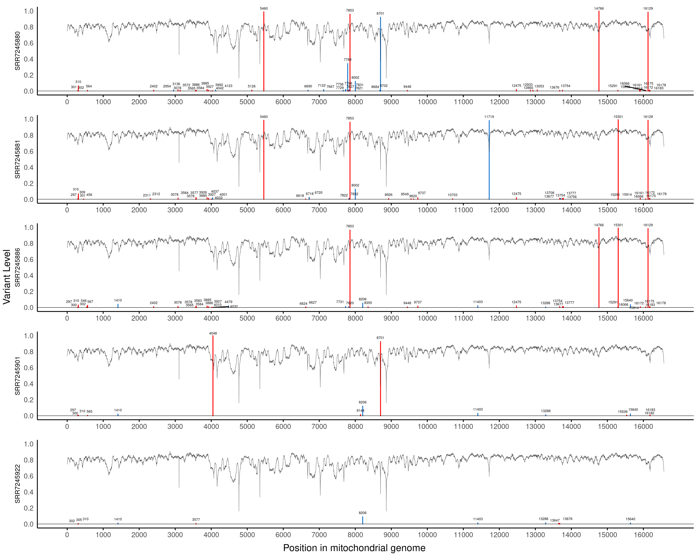
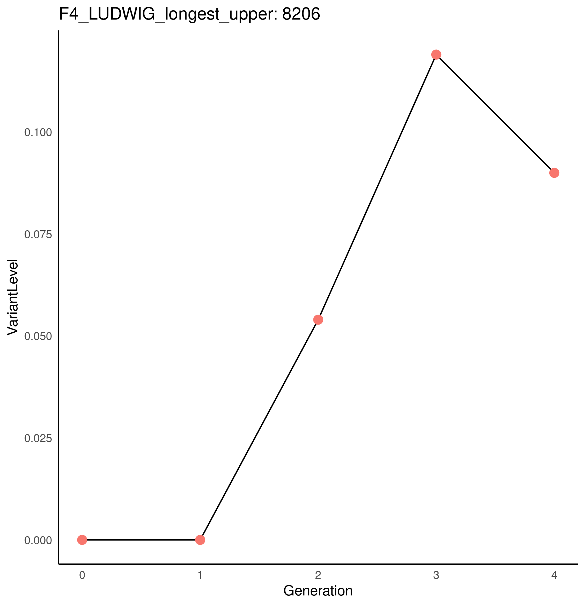

# Ludwig_2019  TODO better title
Re-analysis of data from [Ludwig et al. (2019)](https://doi.org/10.1016/j.cell.2019.01.022), to quantify the expansion of mtDNA mutations throughout the cell culture lineage.  Basically, assume that inital/parent population has exactly the human mtDNA reference genome (this doesn't quite seem to be the case) then look for point mutations by aligning reads from each generation with human mtDNA reference genome, counting the proportion of point mutations (deviations from reference genome) at each nucleobase.  By examining how mutation loads change along each cell lineage, we can observe (non-pathogenic) mutation populations expanding and contracting during the strict and relaxed mtDNA replication occurring in cell culture.
TODO not pdf - jpg or png

# Additional software 
Most of the programs used in this pipeline is already installed as a SLURM module, or is automatically downloaded and installed. However, SRAtoolkit must be installed _interactively_. To do this, execute **configure\_sratools.sh** line by line from the login node terminal (ie. do not submit script to SLURM), by pasting and executing all commands from `configure_sratools.sh`. When prompted set default configuration by inputting: "f","y","o","x","y","o".

# Workflow
Stages of the pipeline are split into _ bash scripts. This is to allow different stages to be evaluated and adjusted if necessary before proceeding. For example: the quality of the data should be checked before alignment.

Run scripts for the following stages by submitting batch jobs to SLURM partitions: `sbatch SCRIPT_NAME.sh`

1. Prefetch .sra files from the sequence read archive, and convert to fastq format. (prefetch\_files.sh)
2. Assess prealignment quality (QC.sh)
3. Align reads to reference genome (analyse.sh)
4. Assess alignment quality (post\_alignment\_QC.sh)
5. Variant call (variant\_call.sh)
6. Visualise and explore heteroplasmic variants (plot\_mutations.sh)

**prefetch\_files.sh** is a BASH shell script. Calls **parse.py** to get metadata (creates SRR\_Acc\_List.txt with all the SRR names: one name per sample, for all the samples Ludwig et al., 2019). Uses SRR names in SRR\_Acc\_List.txt to download SRR files from the sequence read archive. Checks to make sure each SRR has been downloaded and is complete. If not, attempts to redownload. Saves .sra files to sra/sra/SRR\*.sra

**parse.py** is a custom python script called by analyse.sh which gets the connection between GSM IDs (e.g. from metadata [here](https://www.ncbi.nlm.nih.gov/geo/query/acc.cgi?acc=GSE115218) and SRX IDs, which are needed to download the actual raw data.

**QC.sh** is a BASH shell script. Takes the SRR\*.fastq files in the group/s defined in **categories.txt**, and produces a quality report for each file using the program fastQC (results in fastQC\_results/). Then produces a summary of the whole group's quality using the program multiQC (results in multiQC/). See **categories.txt** for details.

**categories.txt** is a text file which contains one "SRP" number per line. This refers to a group of sequencing runs from Ludwig et al., 2019. eg."SRP149534" refers to all TF1 cells bulk-ATAC-seq samples. Please select one of the 14 subseries from GSE115218 GEO entry of Ludwig et al., data to see the corresponding "SRP" number: [https://www.ncbi.nlm.nih.gov/geo/query/acc.cgi?acc=GSE115218]

**analyse.sh** is a BASH shell script that builds indices from the reference genome, aligns reads to the whole human genome, using [bowtie2](http://bowtie-bio.sourceforge.net/bowtie2/index.shtml). In this way reads of NUMTs (nuclear mitochondrial DNA: transposed from the mitochondrial genome to the nuclear genome) should not be mapped to the mitochondrial genome where they can introduce false variant calls. The raw alignment results (alignment\_stdout.txt) and a summary (alignment\_summary.txt) are produced. 

**post\_alignment\_QC.sh** is a BASH shell script that 

 
**plot\_mutations\_script.R** is an R script which outputs tables and plots to summarise and visualise heteroplasmic point mutations, to explore how allele frequencies change through different cell lineages. It also produces plots for different stages of pipeline, including pre-alignment quality plots, post-alignment. Finally it provides comparisons with the 44 high confidence alleles detected by Ludwig et al., 2019. 
It takes annotated mutserve variant files, coverage and read depth files, sample metadata, and Ludwig et al., allele frequency data, and lineage path information specified in **lineages\_paths.txt**.

For example, here is an exploratory plot of unfiltered, heteroplasmic or low-level variants for the samples in one possible path through the F4 lineage.

Using exploratory plots like the example above and the tables of heteroplasmic variant frequencies, individual point mutations which may show stochastic changes in allele frequency can be found, and their mutation load profiles for a lineage plotted, (specified in **lineage\_paths.txt**).

