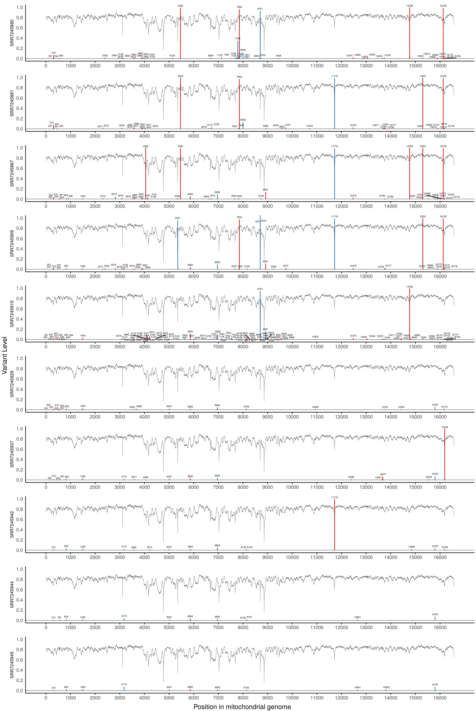
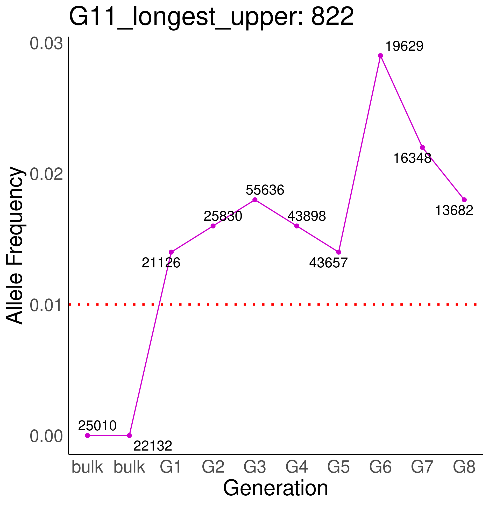

   

&nbsp;  
&nbsp;  
&nbsp;  
&nbsp;  
# A framework for tracking heteroplasmic mitochondrial mutations through cell lineages
> This research project was carried out and written up as the thesis for my MSc Bioinformatics degree at Newcastle University, and to assist research at the Wellcome Centre for Mitochondrial Research. It was supervised by Dr Conor Lawless and Dr Dasha Deen. My full thesis can be found [here](./A_framework_for_tracking_heteroplasmic_mitochondrial_mutations_through_cell_lineages.pdf).

This specialized variant calling pipeline was developed to identify (non-pathogenic) mitochondrial mutations undergoing clonal expansion in human cell lineages. Improved understanding of clonal expansion may be necessary for the development of treatments for mitochondrial diseases in the future; this pipeline is intended to provide allele frequency data for mathematical modelling of mtDNA population dynamics.

This pipeline is currently tailored for re-analysis of bulk ATAC-seq data from [Ludwig _et al._ (2019)](https://doi.org/10.1016/j.cell.2019.01.022) to quantify the expansion of mtDNA mutations throughout indirectly related clonal human cell cultures.  
&nbsp;  
  

# Detecting Clonal Expansion through Lineage Validation
Specific properties are expected in mutations which show clonal expansion: they are heteroplasmic, inherited, and should demonstrate an autocorrelated pattern of changes in allele frequency between generations. These properties also provide a unique opportunity to validate variant calls: very low-level mutations which may be indistinguishable from sequencing/PCR errors in an individual, can be called with confidence when inherited and observed in related clone. Termed as _Lineage validation_, this improves variant calling because some of the limitations when calling mutations in single clones with high confidence can be bypassed. Relatively relaxed filters are used for initial variant calls in order to maximise the number of true positive, low-level calls. Then the mutations are filtered through lineage validation. This simultaneously removes potentially false positive calls from errors, (only called in individual clones), and identifies inherited mutations which may show clonal expansion. The allele frequencies of the variant calls are visualised for each path through a lineage tree, and an autocorrelated pattern of changes in allele frquencies can be used to identify clonal expansion.

# Workflow
Stages of the pipeline are split into 6 bash scripts. This is to allow different stages to be evaluated and adjusted if necessary before proceeding. For example: the quality of the data should be checked before alignment.

Run scripts for the following stages by submitting batch jobs to SLURM partitions: `sbatch SCRIPT_NAME.sh`

1. Prefetch .sra files from the sequence read archive, and convert to fastq format. (prefetch\_files.sh)
2. Assess prealignment quality (QC.sh)
3. Align reads to reference genome (analyse.sh)
4. Assess alignment quality (post\_alignment\_QC.sh)
5. Variant call (variant\_call.sh)
6. Visualise and explore clonal expansion in heteroplasmic variants (plot\_mutations.sh)

**prefetch\_files.sh** is a BASH shell script. Calls **parse.py** to get metadata (creates SRR\_Acc\_List.txt with all the SRR names: one name per sample, for all the samples Ludwig et al., 2019). Uses SRR names in SRR\_Acc\_List.txt to download SRR files from the sequence read archive. Checks to make sure each SRR has been downloaded and is complete. If not, attempts to redownload. Saves .sra files to sra/sra/SRR\*.sra

**parse.py** is a custom python script called by analyse.sh which gets the connection between GSM IDs (e.g. from metadata [here](https://www.ncbi.nlm.nih.gov/geo/query/acc.cgi?acc=GSE115218) and SRX IDs, which are needed to download the actual raw data.

**QC.sh** is a BASH shell script. Takes the SRR\*.fastq files in the group/s defined in **categories.txt**, and produces a quality report for each file using the program fastQC (results in fastQC\_results/). Then produces a summary of the whole group's quality using the program multiQC (results in multiQC/). See **categories.txt** for details.

**categories.txt** is a text file which contains one "SRP" number per line. This refers to a group of sequencing runs from Ludwig et al., 2019. eg."SRP149534" refers to all TF1 cells bulk-ATAC-seq samples. Please select one of the 14 subseries from GSE115218 GEO entry of Ludwig et al., data to see the corresponding "SRP" number: [https://www.ncbi.nlm.nih.gov/geo/query/acc.cgi?acc=GSE115218]

**analyse.sh** is a BASH shell script that builds indices from the reference genome, aligns reads to the whole human genome, using [bowtie2](http://bowtie-bio.sourceforge.net/bowtie2/index.shtml). In this way reads of NUMTs (nuclear mitochondrial DNA: transposed from the mitochondrial genome to the nuclear genome) should not be mapped to the mitochondrial genome where they can introduce false variant calls. The raw alignment results (alignment\_stdout.txt) and a summary (alignment\_summary.txt) are produced. 

**post\_alignment\_QC.sh** is a BASH shell script that TODO

 
**plot\_mutations\_script.R** is an R script which outputs tables and plots to summarise and visualise heteroplasmic point mutations, to explore how allele frequencies change through different cell lineages. It also produces plots for different stages of pipeline, including pre-alignment quality plots, post-alignment. Finally it provides comparisons with the 44 high confidence alleles detected by Ludwig et al., 2019. 
It takes annotated mutserve variant files, coverage and read depth files, sample metadata, and Ludwig et al., allele frequency data, and lineage path information specified in **lineages\_paths.txt**.

### Variant Calling
1. Read filtering: 
* Mapping quality >18
* Base quality >20
* Alignment quality >30
2. Variant filtering:
* Allele frequency >0.001 and < 0.990 (heteroplasmic)
* Exclude sites with coverage of <10 reads per strand
* Exclude alleles with < 3 reads per allele per strand
* Mutserve applies a maximum likelihood model to account for sequencing errors
* Mutserve annotates calls with strand bias
3. __Lineage Validation__
* Mutation must be _present in >1 clone in a lineage_, and have an _allele frequency >0.01 in at least one clone_ in the lineage. This allows confidence in a mutation with an allele frequency above the standard minimum threshold for sequencing/PCR errors (0.01) to be extended to low-level and indirectly inherited mutations (which would otherwise be indistinguishable from PCR error) at the same genomic position of related clones, in the same lineage.

Here is an example of an exploratory plot of unfiltered, heteroplasmic or low-level variants for the samples in one possible path through the F4 lineage.

Using exploratory plots like the example above and the tables of heteroplasmic variant frequencies, individual point mutations which may show stochastic changes in allele frequency can be found, and their mutation load profiles for a lineage plotted, (specified in **lineage\_paths.txt**).

# Additional software 
Most of the programs used in this pipeline are already installed as a SLURM module, or is automatically downloaded and installed. However, SRAtoolkit must be installed _interactively_. To do this, execute **configure\_sratools.sh** line by line from the login node terminal (ie. do not submit script to SLURM), by pasting and executing all commands from `configure_sratools.sh`. When prompted set default configuration by inputting: "f","y","o","x","y","o".

